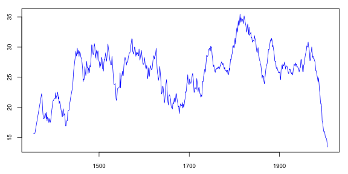

<!-- README.md is generated from README.Rmd. Please edit that file -->
### Introduction

This package provides example datasets of multivariate unevenly spaced time series. The data can be loaded, viewed, plotted, and analyzed using the [uts](https://github.com/andreas50/uts), [utsMultivariate](https://github.com/andreas50/utsMultivariate), and utsTrendSeasonality (coming soon) `R` packages.

### Installation

This package is not yet available on CRAN, but can be installled from GitHub, either using the `R` package [devtools](https://cran.r-project.org/web/packages/devtools/index.html):

``` r
devtools::install_github("andreas50/uts", build_vignettes=TRUE)
devtools::install_github("andreas50/utsMultivariate")
devtools::install_github("andreas50/utsData")
```

or using the `R` package [remotes](https://cran.r-project.org/web/packages/remotes/index.html):

``` r
remotes::install_github("andreas50/uts")
remotes::install_github("andreas50/utsMultivariate")
remotes::install_github("andreas50/utsData")
```

### Sample Code

``` r
# Mauna Loa atmospheric CO2 concentration
plot(co2_ml)
```


``` r
# Most consecutive observations are one month apart
table(round(diff(time(co2_ml)) / 365 * 12))
#> 
#>   1   2   4 
#> 710   4   1
```

``` r
# Grape harvest dates (relative to August 31st) for Bordeaux region
# -) observations less than 2 years apart are connected by a line in the polot
plot(grapes$Bordeaux, max_dt=dyears(2), type="o", cex=0.5)
```


``` r
# Same, but plot 20-year two-sided rolling average
if (requireNamespace("utsOperators", quietly=TRUE)) {
  plot(utsOperators::rolling_apply(grapes$Burgundy, width=dyears(20), FUN=mean, align="center"))
}
```


